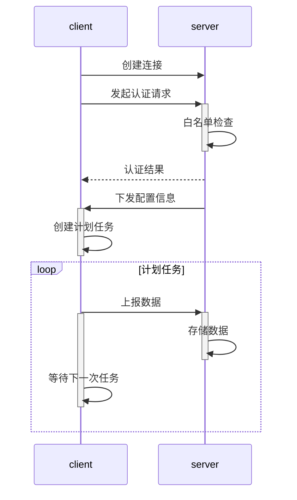
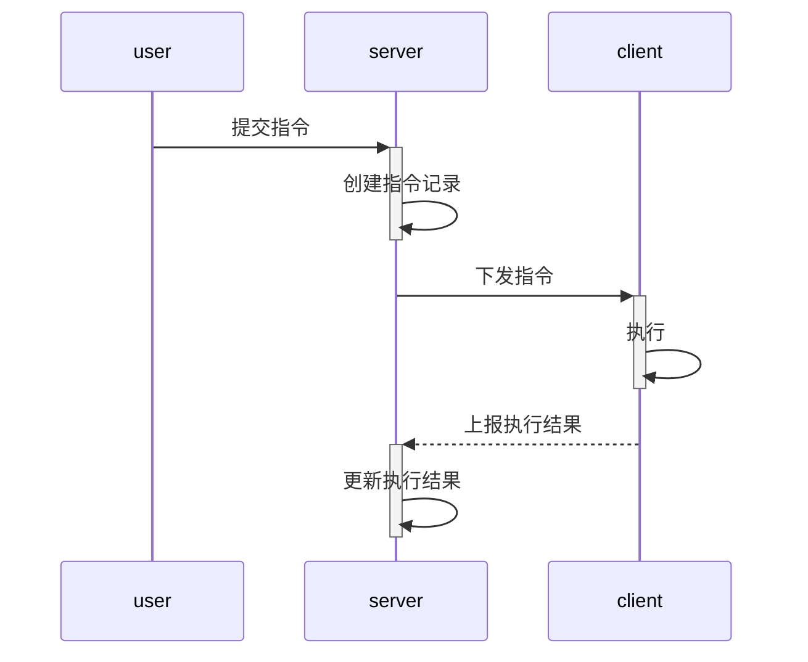

# About ops-demo

一个可以用来学习 Netty 的相当精简的样例项目，它演示了该如何在实际网络开发中完成基础的*协议约定*、
*协议解析*和*组包拆包*工作，在项目中还实现了*断线重连*和*心跳检测机制*，除此之外，还有*连接白名
单*和*动态处理器*的实现。

## 背景

近两年连续参与了好几个物联网的项目，几乎都用到了`Netty`，回想自己在网络编程这条路上的探索过程，可谓
是相当的崎岖，尤其是在刚开始的那个阶段，苦于找不到一个完善又相对简单的样例项目。 刚好近期整理项目资料
时，发现其中一个智慧运维的项目很适合用来当做学习案例，所以就有了这个项目。当然，为了让项目看起来浅显
易懂，我剔除了大量与本项目无关的功能，仅保留了非常小的一部分功能作为演示。

## 流程简述

`server`方维护了一份服务器清单，该清单描述了服务器的IP地址、名称等信息；`client`方作为客户端应用
程序部署在服务器上，负责向`server`方上报数据和执行`server`方下发的指令。

#### (1) 数据上报



- `client`在与`server`成功建立连接后，将立马发起
[认证请求](/client/src/main/java/cn/skt/ConnectionStatusListener.java)
- `server`收到认证请求后，检查`client`是否在服务器清单内，并立即返回
[认证结果](/server/src/main/java/cn/handler/AuthRequestHandler.java)，如果认证成功，还会向
`client`下发该服务器的[配置信息](/server/src/main/java/cn/handler/AuthRequestHandler.java)
- `client`收到配置信息后，根据配置内容在本地创建计划任务，定时向`server`上报所收集到的数据

#### (2) 指令执行



- `user`通过接口
[post:: /server/exec/order/{id}](server/src/main/java/cn/controller/ServerController.java)
向`server`提交指令
- `server`将该指令转发给对应的`client`进行执行
- `client`执行完毕后，向`server`上报指令执行结果


## 快速开始

#### Step 1: 启动 `server`

启动服务端[ServerApplication](/server/src/main/java/cn/ServerApplication.java)，服务端为
SpringBoot 应用，启动了两个端口，包括 Web 端口
[server.port](server/src/main/resources/application.yml)和 Socket 端口
[ops.server.port](server/src/main/resources/application.yml)。

#### Step 2: 添加白名单

调用接口 [post:: /server/add](server/src/main/java/cn/controller/ServerController.java)，
向服务端注册客户端的IP、名称等信息，这些信息将在客户端连接服务端时被使用。如下是一个请求示例：

```http request
POST http://localhost:port/server/add
Content-Type: application/json

{
  "name": "My-Server",
  "ip": "127.0.0.1"
}
```

#### Step 3: 启动 `client`

启动客户端[Launcher](/client/src/main/java/cn/Launcher.java)。

## 更多
此项目仅仅只是一个样例，后续作者将不不会再对其维护。如果你对该项目有疑问，可以在
[issue](https://github.com/nackily/ops-demo/issues)中留下评论。